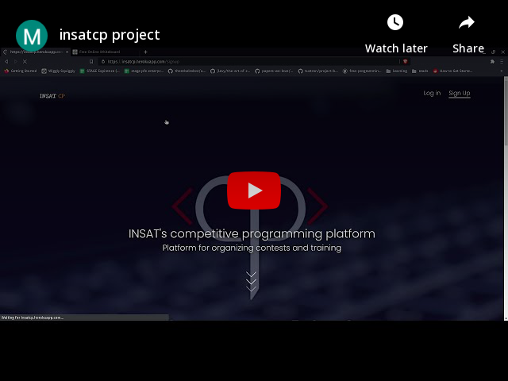

# INSAT-CP

## Contributors:

* [Azer Chabbar](https://github.com/Azer-ch)
* [Ala ben Hammouda](https://github.com/alabenhamouda/)
* [Mohammed khalil Ben Abdallah](https://github.com/med-khalil)
* [Bechir Brahem](https://github.com/Bechir-Brahem)

## Introduction:

This is a competitive programming website made to organize contests, and solve algorithmic problems and learn about algorithmic optimization techniques

This web app accepts code submissions from signed up users. compiles them and then run the code with the input of the given problem and compares the output
of the run to the correct solution.
It also contains tutorials on the fundamental algorithmic topics

## Implementation:

for this project we used the following technologies:
* symfony version 5
* postgreSQL
* judge0 API
* azure web sevices (for hosting the judge API on a VM)
* heroku for the deployment

## Demo:

https://insatcp.herokuapp.com/

